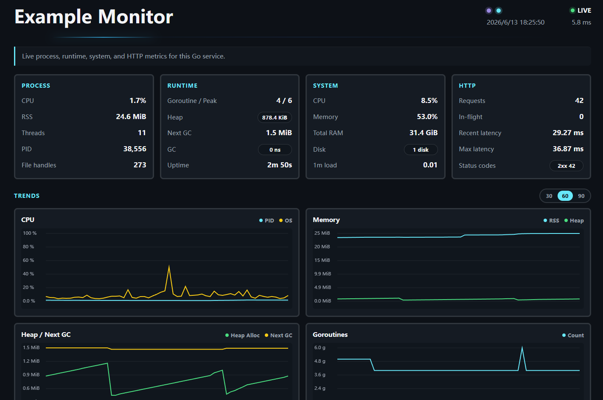

# monitor

<p align="center">
  &nbsp&nbsp&nbsp
  &nbsp&nbsp&nbsp
  <a href="https://github.com/gofurry/monitor/actions/workflows/ci.yml"></a>&nbsp&nbsp&nbsp
  <a href="https://goreportcard.com/report/github.com/gofurry/monitor"></a>&nbsp&nbsp&nbsp
</p>

<p align="left">
  English | 
  <a href="docs/zh/README.md">中文</a>
</p>

A tiny `net/http` middleware for real-time Go service status.

`monitor` is intentionally small: one middleware, one page, one JSON snapshot.

The status page is fully embedded and requires no frontend build step or external JavaScript libraries.

It includes:

- light / dark theme
- solid / grid background
- English and Simplified Chinese UI
- LIVE / STALE / ERROR status
- small in-browser trend charts powered by native Canvas
- JSON snapshot via `Accept: application/json`

Charts keep only short in-browser history. Metrics are not stored server-side. Restarting the process clears in-memory counters and chart history.

<p align="center">
  
</p>

## Installation

```sh
go get github.com/gofurry/monitor
```

## Quick Start

```go
package main

import (
	"net/http"

	"github.com/gofurry/monitor"
)

func main() {
	mux := http.NewServeMux()
	mux.HandleFunc("/", func(w http.ResponseWriter, r *http.Request) {
		_, _ = w.Write([]byte("hello"))
	})

	handler := monitor.New(mux)
	_ = http.ListenAndServe(":8080", handler)
}
```

Open:

```text
http://localhost:8080/monitor
```

Fetch JSON:

```sh
curl -H "Accept: application/json" http://localhost:8080/monitor
```

## Fiber

`monitor` is built on `net/http`. Fiber is based on `fasthttp`, but Fiber's official adaptor middleware can wrap `net/http` middleware:

```go
package main

import (
	"net/http"

	"github.com/gofiber/fiber/v2"
	"github.com/gofiber/fiber/v2/middleware/adaptor"
	"github.com/gofurry/monitor"
)

func main() {
	app := fiber.New()

	app.Use(adaptor.HTTPMiddleware(func(next http.Handler) http.Handler {
		return monitor.New(next, monitor.Config{
			Path: "/monitor",
		})
	}))

	app.Get("/", func(c *fiber.Ctx) error {
		return c.SendString("hello")
	})

	_ = app.Listen(":8080")
}
```

Open `http://localhost:8080/monitor`.

## Configuration

```go
handler := monitor.New(mux, monitor.Config{
	Path:                "/monitor",
	Title:               "My App Monitor",
	Description:         "Live production service metrics.",
	Footer:              "Copyright 2026 Example Inc.",
	DefaultLanguage:     "en",
	DefaultTheme:        "dark",
	Background:          "solid",
	DefaultSampleWindow: 60,
	DiskPaths:           nil,
	Refresh:             2 * time.Second,
	APIOnly:             false,
	IgnoreRequest: func(r *http.Request) bool {
		return r.URL.Path == "/healthz" || r.URL.Path == "/readyz"
	},
})
```

Defaults:

| Field | Default | Description |
|---|---:|---|
| `Path` | `/monitor` | Endpoint for the HTML page and JSON snapshot. |
| `Title` | `Monitor` | HTML page title and heading. |
| `Description` | `Live process, runtime, system, and HTTP metrics for this Go service.` | Short visible description below the header. |
| `Footer` | `Powered by github.com/gofurry/monitor - MIT License.` | Footer text for copyright, ownership, or license notes. |
| `DefaultLanguage` | `en` | Initial UI language when no browser preference is saved. Supported values: `en`, `zh-CN`. |
| `DefaultTheme` | `dark` | Initial UI theme when no browser preference is saved. Supported values: `light`, `dark`. |
| `Background` | `solid` | HTML page background. Supported values: `solid`, `grid`. |
| `DefaultSampleWindow` | `60` | Initial trend chart sample count. Supported values: `30`, `60`, `90`. |
| `DiskPaths` | `nil` | Filesystem paths to sample for disk usage. Empty uses the current working directory's filesystem. |
| `Refresh` | `2s` | Background metrics collection interval. |
| `APIOnly` | `false` | Return JSON from `Path` without serving HTML. |
| `IgnoreRequest` | `nil` | Exclude selected requests from `http.total_requests`. |

Requests to `Path` are always excluded from `http.total_requests`; the monitor page and its JSON polling do not inflate the business request count. `IgnoreRequest` is for other non-business traffic, such as load balancer probes or health checks. Ignored requests are still served by your handler.

## Best Practice

`monitor` does not persist metrics, logs, traces, or chart history. It shows the current process, current host, Go runtime, and requests handled by this middleware instance.

It is best suited for single-node monolithic Go services where you want a very lightweight built-in status page for local service health and basic runtime visibility.

Use a dedicated observability stack such as Prometheus, Grafana, tracing, and centralized logs when you need:

- long-term history
- alerts
- multi-instance aggregation
- distributed tracing
- business metrics
- cluster-wide dashboards

## Scope

`monitor` does:

- expose a lightweight status page
- expose a JSON snapshot
- show current process metrics
- show Go runtime metrics, including GC pause timing
- show basic system metrics
- count total business requests
- track in-flight business requests, HTTP status code classes, and recent request latency
- render short in-browser trend charts without external chart libraries
- support light / dark theme
- support English and Simplified Chinese UI

`monitor` does not:

- store historical metrics
- send alerts
- replace Prometheus or Grafana
- provide tracing
- aggregate multiple instances
- collect application-specific business metrics
- store chart history server-side
- depend on external charting libraries
- provide configurable alert thresholds

## JSON Snapshot

```json
{
  "pid": {
    "cpu_percent": 2.4,
    "rss_bytes": 48140288,
    "pid": 12345,
    "threads": 12,
    "fds": 32
  },
  "runtime": {
    "goroutines": 18,
    "goroutine_peak": 42,
    "heap_alloc_bytes": 7327744,
    "heap_sys_bytes": 12582912,
    "heap_objects": 42011,
    "next_gc_bytes": 14655488,
    "mallocs": 260112,
    "frees": 218101,
    "num_gc": 12,
    "gc_pause_last_ns": 128000,
    "gc_pause_total_ns": 3200000,
    "gc_pause_recent_ns": 128000,
    "uptime_seconds": 3600
  },
  "os": {
    "cpu_percent": 12.8,
    "memory_used_percent": 61.5,
    "memory_total_bytes": 8589934592,
    "disk_used_percent": 47.2,
    "disk_total_bytes": 512110190592,
    "disk_used_bytes": 241737318400,
    "disks": [
      {
        "path": "C:\\",
        "device": "C:",
        "fstype": "NTFS",
        "total_bytes": 512110190592,
        "used_bytes": 241737318400,
        "free_bytes": 270372872192,
        "used_percent": 47.2
      },
      {
        "path": "D:\\",
        "device": "D:",
        "fstype": "NTFS",
        "total_bytes": 1024209543168,
        "used_bytes": 388547952640,
        "free_bytes": 635661590528,
        "used_percent": 37.9
      }
    ],
    "load1": 0.42
  },
  "http": {
    "total_requests": 1024,
    "in_flight_requests": 2,
    "status_codes": {
      "1xx": 0,
      "2xx": 1000,
      "3xx": 12,
      "4xx": 10,
      "5xx": 2
    },
    "latency": {
      "last_ns": 812000,
      "recent_ns": 924500,
      "max_ns": 12000000
    }
  }
}
```

## Lifecycle

`New` returns an `http.Handler` for the simplest setup. Use `NewMonitor` when you want to read the current snapshot or stop the collector explicitly:

```go
m := monitor.NewMonitor(mux)
defer m.Stop()

stats := m.Current()
_ = stats
```

`Monitor` is safe for concurrent use.

## Performance Baseline

Run the benchmark baseline with:

```sh
go test -run=^$ -bench=Benchmark -benchmem .
```

The benchmark suite covers:

- direct `net/http` handler overhead
- monitor-wrapped business requests
- parallel business requests
- ignored requests
- JSON snapshot responses
- HTML status page responses
- `Current()` snapshot reads

## Notes

- Requests to the monitor path are not counted as business requests.
- The monitor path accepts only `GET` and `HEAD`, and responses use `Cache-Control: no-store`, `Referrer-Policy: no-referrer`, and `X-Content-Type-Options: nosniff`.
- Metrics are collected in a background ticker and served from the latest race-safe snapshot.
- Partial metric collection failures leave the affected values at zero instead of making the monitor endpoint fail.
- The HTML page has no external frontend dependencies; its template, CSS, and JavaScript are embedded from `internal/ui`.

## Related Documents

- [Contributing](CONTRIBUTING.md) / [贡献指南](docs/zh/CONTRIBUTING.md)
- [Security Policy](SECURITY.md) / [安全政策](docs/zh/SECURITY.md)
