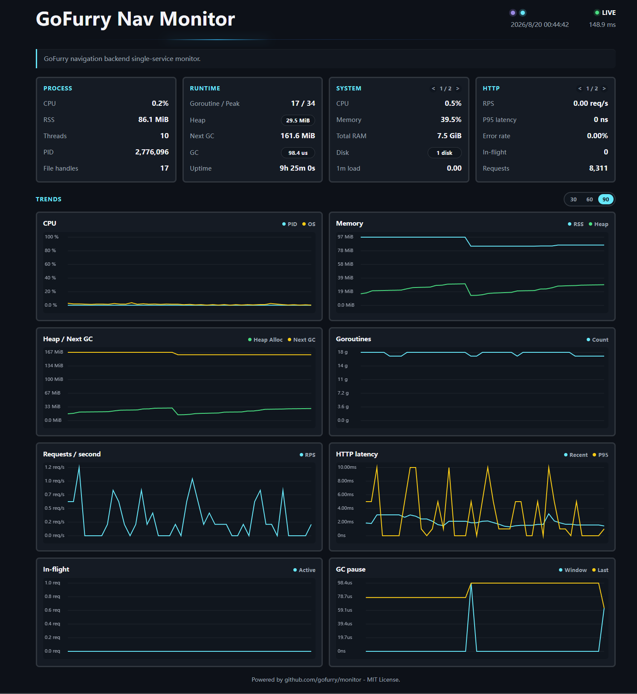

# monitor

<p align="center">
  &nbsp&nbsp&nbsp
  &nbsp&nbsp&nbsp
  <a href="https://github.com/gofurry/monitor/actions/workflows/ci.yml"></a>&nbsp&nbsp&nbsp
  <a href="https://goreportcard.com/report/github.com/gofurry/monitor"></a>&nbsp&nbsp&nbsp
</p>

<p align="left">
  English | 
  <a href="docs/zh/README.md">中文</a>
</p>

A tiny `net/http` middleware for real-time Go service status.

`monitor` is intentionally small: one middleware, one page, one JSON snapshot.

The status page is fully embedded and requires no frontend build step or external JavaScript libraries.

It includes:

- light / dark theme
- solid / grid background
- English and Simplified Chinese UI
- LIVE / PARTIAL / STALE / ERROR status
- small in-browser trend charts powered by native Canvas
- JSON snapshot via `Accept: application/json`
- request rate, recent error rates, and latency percentiles
- aggregate network I/O and Linux cgroup v2 limits

Charts keep only short in-browser history. Metrics are not stored server-side. Restarting the process clears in-memory counters and chart history.

<p align="center">
  
</p>

## Installation

```sh
go get github.com/gofurry/monitor
```

## Quick Start

```go
package main

import (
	"net/http"

	"github.com/gofurry/monitor"
)

func main() {
	mux := http.NewServeMux()
	mux.HandleFunc("/", func(w http.ResponseWriter, r *http.Request) {
		_, _ = w.Write([]byte("hello"))
	})

	handler := monitor.New(mux)
	_ = http.ListenAndServe(":8080", handler)
}
```

Open:

```text
http://localhost:8080/monitor
```

Fetch JSON:

```sh
curl -H "Accept: application/json" http://localhost:8080/monitor
```

## Fiber

`monitor` is built on `net/http`. Fiber is based on `fasthttp`, so create one monitor instance during startup, expose only the monitor endpoint through Fiber's official adaptor, and record business requests with Fiber-native middleware.

> Important: do not call `monitor.New` or `monitor.NewMonitor` inside `adaptor.HTTPMiddleware`.
> Fiber executes that middleware factory for every request, while each monitor instance starts one background collector goroutine. Creating a monitor instance per request will leak collector goroutines.

```go
package main

import (
	"net/http"

	"github.com/gofiber/fiber/v3"
	"github.com/gofiber/fiber/v3/middleware/adaptor"
	"github.com/gofurry/monitor"
)

func main() {
	app := fiber.New()

	m := monitor.NewMonitor(http.NotFoundHandler(), monitor.Config{
		Path: "/monitor",
	})
	defer m.Stop()

	app.Use(func(c fiber.Ctx) error {
		if c.Path() == "/monitor" {
			return c.Next()
		}

		finish := m.BeginRequest()
		err := c.Next()

		status := c.Response().StatusCode()
		if err != nil {
			status = fiber.StatusInternalServerError
			if fiberErr, ok := err.(*fiber.Error); ok {
				status = fiberErr.Code
			}
		}
		finish(status)
		return err
	})

	app.All("/monitor", adaptor.HTTPHandler(m))

	app.Get("/", func(c fiber.Ctx) error {
		return c.SendString("hello")
	})

	_ = app.Listen(":8080")
}
```

Open `http://localhost:8080/monitor`.

This Fiber example safely serves the monitor page and JSON snapshot, while `http.total_requests`, in-flight requests, status code classes, and latency are recorded from the native Fiber middleware.

## Gin

Gin runs on `net/http`, but you can still use the framework-neutral request lifecycle methods when you want monitor to stay outside Gin's handler chain.

```go
package main

import (
	"net/http"

	"github.com/gin-gonic/gin"
	"github.com/gofurry/monitor"
)

func main() {
	r := gin.New()
	r.Use(gin.Recovery())

	m := monitor.NewMonitor(http.NotFoundHandler(), monitor.Config{
		Path: "/monitor",
	})
	defer m.Stop()

	r.Use(func(c *gin.Context) {
		if c.Request.URL.Path == "/monitor" {
			c.Next()
			return
		}

		finish := m.BeginRequest()
		c.Next()

		status := c.Writer.Status()
		if status == 0 {
			status = http.StatusOK
		}
		finish(status)
	})

	r.GET("/monitor", gin.WrapH(m))
	r.GET("/", func(c *gin.Context) {
		c.String(http.StatusOK, "hello")
	})

	_ = r.Run(":8080")
}
```

## Echo

Echo can also record requests with the same monitor lifecycle methods.

```go
package main

import (
	"net/http"

	"github.com/gofurry/monitor"
	"github.com/labstack/echo/v4"
)

func main() {
	e := echo.New()

	m := monitor.NewMonitor(http.NotFoundHandler(), monitor.Config{
		Path: "/monitor",
	})
	defer m.Stop()

	e.Use(func(next echo.HandlerFunc) echo.HandlerFunc {
		return func(c echo.Context) error {
			if c.Request().URL.Path == "/monitor" {
				return next(c)
			}

			finish := m.BeginRequest()
			err := next(c)

			status := c.Response().Status
			if err != nil {
				status = http.StatusInternalServerError
				if echoErr, ok := err.(*echo.HTTPError); ok {
					status = echoErr.Code
				}
			}
			if status == 0 {
				status = http.StatusOK
			}
			finish(status)
			return err
		}
	})

	e.GET("/monitor", echo.WrapHandler(m))
	e.GET("/", func(c echo.Context) error {
		return c.String(http.StatusOK, "hello")
	})

	_ = e.Start(":8080")
}
```

## Configuration

```go
handler := monitor.New(mux, monitor.Config{
	Path:                "/monitor",
	Title:               "My App Monitor",
	Description:         "Live production service metrics.",
	Footer:              "Copyright 2026 Example Inc.",
	FaviconURL:          "/assets/favicon.svg",
	DefaultLanguage:     "en",
	DefaultTheme:        "dark",
	Background:          "solid",
	DefaultSampleWindow: 60,
	DiskPaths:           nil,
	Refresh:             2 * time.Second,
	APIOnly:             false,
	Authorize: func(r *http.Request) bool {
		return r.Header.Get("Authorization") == "Bearer change-me"
	},
	IgnoreRequest: func(r *http.Request) bool {
		return r.URL.Path == "/healthz" || r.URL.Path == "/readyz"
	},
})
```

Defaults:

| Field | Default | Description |
|---|---:|---|
| `Path` | `/monitor` | Endpoint for the HTML page and JSON snapshot. |
| `Title` | `Monitor` | HTML page title and heading. |
| `Description` | `Live process, runtime, system, and HTTP metrics for this Go service.` | Short visible description below the header. |
| `Footer` | `Powered by github.com/gofurry/monitor - MIT License.` | Footer text for copyright, ownership, or license notes. |
| `FaviconURL` | built-in favicon | Overrides the dashboard favicon with a root-relative path or absolute HTTP(S) URL. Empty or invalid values use the built-in favicon. |
| `DefaultLanguage` | `en` | Initial UI language when no browser preference is saved. Supported values: `en`, `zh-CN`. |
| `DefaultTheme` | `dark` | Initial UI theme when no browser preference is saved. Supported values: `light`, `dark`. |
| `Background` | `solid` | HTML page background. Supported values: `solid`, `grid`. |
| `DefaultSampleWindow` | `60` | Initial trend chart sample count. Supported values: `30`, `60`, `90`. |
| `DiskPaths` | `nil` | Filesystem paths to sample for disk usage. Empty uses the current working directory's filesystem. |
| `Refresh` | `2s` | Background metrics collection interval; values below `250ms` are clamped to `250ms`. |
| `APIOnly` | `false` | Return JSON from `Path` without serving HTML. |
| `Authorize` | `nil` | Allow or deny requests to `Path`; denied requests receive `401 Unauthorized`. |
| `IgnoreRequest` | `nil` | Exclude selected requests from `http.total_requests`. |

Requests to `Path` are always excluded from `http.total_requests`; the monitor page and its JSON polling do not inflate the business request count. `IgnoreRequest` is for other non-business traffic, such as load balancer probes or health checks. Ignored requests are still served by your handler.

### Dashboard favicon

The dashboard includes an embedded favicon by default. Set `FaviconURL` to use a favicon served by your application or a remote HTTP(S) URL:

```go
handler := monitor.New(mux, monitor.Config{
	FaviconURL: "/assets/favicon.svg",
})
```

Filesystem paths such as `./favicon.ico` are not supported directly. Serve the file through your application first, then configure its URL. A same-origin URL is preferred because a remote favicon causes every dashboard visitor's browser to contact that host.

### Access control

The dashboard exposes operational data and should not be public by default in production. `Authorize` applies only to the configured monitor path and runs before method dispatch, so unauthorized HTML, JSON, `HEAD`, and unsupported-method requests all receive `401 Unauthorized`.

```go
handler := monitor.New(mux, monitor.Config{
	Authorize: func(r *http.Request) bool {
		return subtle.ConstantTimeCompare(
			[]byte(r.Header.Get("Authorization")),
			[]byte("Bearer "+os.Getenv("MONITOR_TOKEN")),
		) == 1
	},
})
```

Terminate TLS and enforce any network-level restrictions outside this package. Never commit monitor tokens to source control.

### Collection behavior

Every snapshot includes its UTC collection time, actual collection duration, and partial status. A collector failure does not fail `/monitor`; the affected UI value is shown as `N/A`, while `collection.errors` contains only stable identifiers such as `pid.cpu`, `os.disk`, `os.network`, or `container.memory`. Underlying operating-system error text is not exposed.

Network totals aggregate every interface reported by the host, including loopback. Rates are zero for the first sample and after a counter reset. On Linux, container metrics read cgroup v2 `memory.current`, `memory.max`, and `cpu.max`; unlimited limits are supported. The container card is hidden unless a container marker, a known cgroup path, or a finite resource-limit combination is detected. Other operating systems return an undetected container snapshot.

## Best Practice

`monitor` does not persist metrics, logs, traces, or chart history. It shows the current process, current host, Go runtime, and requests handled by this middleware instance.

It is best suited for single-node monolithic Go services where you want a very lightweight built-in status page for local service health and basic runtime visibility.

Use a dedicated observability stack such as Prometheus, Grafana, tracing, and centralized logs when you need:

- long-term history
- alerts
- multi-instance aggregation
- distributed tracing
- business metrics
- cluster-wide dashboards

## Scope

`monitor` does:

- expose a lightweight status page
- expose a JSON snapshot
- show current process metrics
- show Go runtime metrics, including GC pause timing
- show basic system metrics
- show aggregate host network totals and rates, including loopback
- show detected Linux cgroup v2 memory and CPU limits
- count total business requests
- track RPS, in-flight requests, status code classes, recent error rates, and latency percentiles
- render short in-browser trend charts without external chart libraries
- support light / dark theme
- support English and Simplified Chinese UI

`monitor` does not:

- store historical metrics
- send alerts
- replace Prometheus or Grafana
- provide tracing
- aggregate multiple instances
- collect application-specific business metrics
- store chart history server-side
- depend on external charting libraries
- provide configurable alert thresholds

## JSON Snapshot

```json
{
  "schema_version": 1,
  "collected_at": "2026-08-09T10:30:00Z",
  "collection": {
    "duration_ns": 1850000,
    "partial": false
  },
  "pid": {
    "cpu_percent": 2.4,
    "rss_bytes": 48140288,
    "pid": 12345,
    "threads": 12,
    "fds": 32
  },
  "runtime": {
    "goroutines": 18,
    "goroutine_peak": 42,
    "heap_alloc_bytes": 7327744,
    "heap_sys_bytes": 12582912,
    "heap_objects": 42011,
    "next_gc_bytes": 14655488,
    "mallocs": 260112,
    "frees": 218101,
    "num_gc": 12,
    "gc_pause_last_ns": 128000,
    "gc_pause_total_ns": 3200000,
    "gc_pause_recent_ns": 128000,
    "uptime_seconds": 3600
  },
  "os": {
    "cpu_percent": 12.8,
    "memory_used_percent": 61.5,
    "memory_total_bytes": 8589934592,
    "disk_used_percent": 47.2,
    "disk_total_bytes": 512110190592,
    "disk_used_bytes": 241737318400,
    "disks": [
      {
        "path": "C:\\",
        "device": "C:",
        "fstype": "NTFS",
        "total_bytes": 512110190592,
        "used_bytes": 241737318400,
        "free_bytes": 270372872192,
        "used_percent": 47.2
      },
      {
        "path": "D:\\",
        "device": "D:",
        "fstype": "NTFS",
        "total_bytes": 1024209543168,
        "used_bytes": 388547952640,
        "free_bytes": 635661590528,
        "used_percent": 37.9
      }
    ],
    "load1": 0.42,
    "network": {
      "received_bytes": 104857600,
      "sent_bytes": 52428800,
      "receive_bps": 8192,
      "send_bps": 4096
    }
  },
  "container": {
    "detected": true,
    "memory_usage_bytes": 134217728,
    "memory_limit_bytes": 536870912,
    "memory_used_percent": 25,
    "cpu_quota_cores": 2
  },
  "http": {
    "total_requests": 1024,
    "in_flight_requests": 2,
    "rps": 18.5,
    "status_codes": {
      "1xx": 0,
      "2xx": 1000,
      "3xx": 12,
      "4xx": 10,
      "5xx": 2
    },
    "rates": {
      "4xx_rate": 0.01,
      "5xx_rate": 0.002,
      "error_rate": 0.012
    },
    "latency": {
      "last_ns": 812000,
      "recent_ns": 924500,
      "p50_ns": 1000000,
      "p95_ns": 5000000,
      "p99_ns": 10000000,
      "recent_max_ns": 11800000,
      "max_ns": 12000000
    }
  }
}
```

## Lifecycle

`New` returns an `http.Handler` for the simplest setup. Use `NewMonitor` when you want to read the current snapshot or stop the collector explicitly:

```go
m := monitor.NewMonitor(mux)
defer m.Stop()

stats := m.Current()
_ = stats
```

For framework adapters, `BeginRequest` pairs start and finish safely and ignores duplicate finish calls:

```go
finish := m.BeginRequest()
defer finish(http.StatusOK)
```

The lower-level `RequestStarted`, `RequestFinished`, and `ObserveRequest` methods remain available. Native `net/http` wrapping uses the direct lifecycle path to keep the hot path allocation profile small.

`Monitor` is safe for concurrent use.

## Performance Baseline

Run the benchmark baseline with:

```sh
go test -run=^$ -bench=Benchmark -benchmem .
```

The benchmark suite covers:

- direct `net/http` handler overhead
- monitor-wrapped business requests
- fixed-bucket latency histogram writes
- `BeginRequest` lifecycle calls
- parallel business requests
- ignored requests
- JSON snapshot responses
- HTML status page responses
- `Current()` snapshot reads

## Notes

- Requests to the monitor path are not counted as business requests.
- The monitor path accepts only `GET` and `HEAD`, and responses use `Cache-Control: no-store`, `Referrer-Policy: no-referrer`, and `X-Content-Type-Options: nosniff`.
- Metrics are collected in a background ticker and served from the latest race-safe snapshot.
- Partial metric collection failures do not make the monitor endpoint fail; JSON reports stable error identifiers and the UI shows affected values as `N/A`.
- The HTML page has no external frontend dependencies; its template, CSS, and JavaScript are embedded from `internal/ui`.

## Related Documents

- [Contributing](CONTRIBUTING.md) / [贡献指南](docs/zh/CONTRIBUTING.md)
- [Security Policy](SECURITY.md) / [安全政策](docs/zh/SECURITY.md)
